# PLIMSOLL

### The market has a load line. Your portfolio should too.

<p align="center">
  <a href="https://github.com/mohamedwael201193/PLIMSOLL/actions/workflows/ci.yml"></a>
</p>

PLIMSOLL is a continuous exposure-capacity agent for Binance Spot trading. It estimates how much exposure the market can support under user-defined exit constraints, makes the binding constraint explicit, and continuously re-solves as market conditions change.

> **Continuous exposure capacity for agentic trading.**
>
> The marked value of a position is not the same thing as the amount of exposure the market can realistically support under a user's stated exit constraints.

<p align="center">
  <a href="https://plimsoll-jade.vercel.app/"><strong>Live Demo</strong></a>
  &nbsp;·&nbsp;
  <a href="https://github.com/mohamedwael201193/PLIMSOLL"><strong>GitHub</strong></a>
  &nbsp;·&nbsp;
  <a href="https://x.com/Mowael777/status/2097473610445209852"><strong>Video Demo</strong></a>
  &nbsp;·&nbsp;
  <a href="https://agent.binance.com/mcp/agentic"><strong>Binance Agent OS / MCP</strong></a>
</p>

<p align="center">
  <video src="https://github.com/mohamedwael201193/PLIMSOLL/raw/main/docs/demo/PLIMSOLL-FINAL.mp4" width="100%" controls playsinline>
    PLIMSOLL demo — product walkthrough and real Binance Agent OS session (2:54, 1920×1080).
  </video>
</p>

> Real execution evidence is in the film above. The public PLIMSOLL website remains honest about its account connection state.

---

## The Problem

Most trading interfaces answer:

**"What is my position worth?"**

PLIMSOLL asks:

**"How much exposure can the market actually support under the way I intend to exit?"**

| | Mark value | Exit capacity |
|---|---|---|
| Question | What is this position priced at right now? | How much can I hold if I must exit under my cost, time, and participation constraints? |
| Input | Last / mid price × quantity | Visible book, 24h quote volume, fees, exchange filters, user constitution |
| Failure mode | Looks fine until you try to leave | Bound by the tightest constraint, then re-solved when the book moves |

A position can look acceptable by mark value and still be difficult to exit. Thin bids, a tight cost budget, or a short horizon turn "I am in" into "I cannot get out on my terms."

PLIMSOLL does not call this a maximum safe size. It does not guarantee an exit. It estimates capacity on a captured snapshot, under constraints the user stated.

---

## The Load Line

The system turns user exit constraints into an estimated exposure boundary — a load line. **The line moves when the market moves.**

<p align="center">
  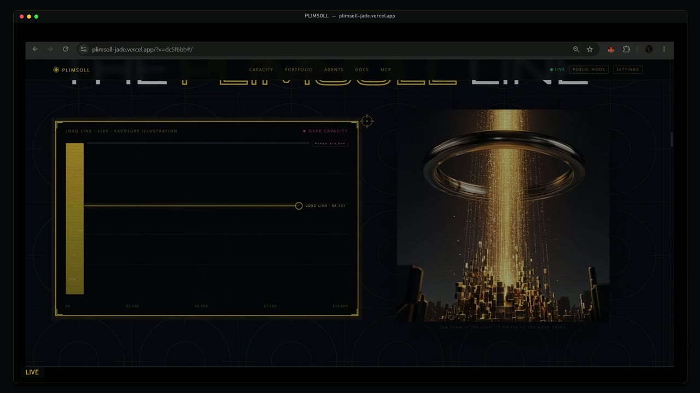
</p>

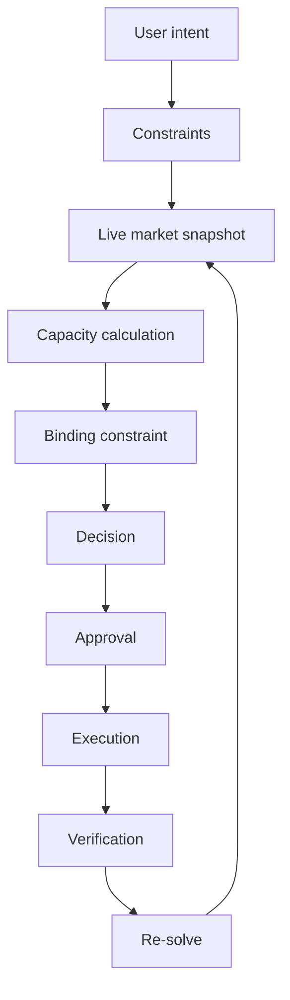

Default constitution (overridable per ask):

| Constraint | Default | Meaning |
|---|---|---|
| `max_exit_cost_bps` | `50` | All-in taker cost budget for a simulated exit into bids |
| `max_exit_horizon_days` | `1` | Time window used with participation |
| `max_participation` | `0.10` | Fraction of 24h quote volume — shown, not hidden |
| `max_fraction_of_visible_book` | `0.5` | Cap against visible bid notional |
| `taker_fee_bps` | `10` | Added to impact when walking the book |
| `stale_timeout_ms` | `5000` | Older snapshots refuse action |

---

## How Capacity Works

Capacity is **deterministic Python** in `backend/app/core/capacity.py`, `cost.py`, `book.py`, `filters.py`, and `sizing.py`. The language layer does not compute it.

Exit is modelled as **selling into visible bids** (`exit_side: SELL_INTO_BIDS`).

### Cost capacity

Walk the visible bid book. For a candidate quote notional, consume levels until that notional is filled, compute VWAP, then all-in taker cost versus mid:

```text
impact_bps = ((mid − vwap) / mid) × 10000
all_in     = impact_bps + taker_fee_bps
```

A size is feasible only if `all_in ≤ max_exit_cost_bps` and the book is not exhausted. Cost capacity is the largest such notional found by a 64-step binary search over `[0, visible_bid_notional]`, quantized down to `0.01`.

### Time capacity

```text
time_capacity = max_participation × quote_volume_24h × max_exit_horizon_days
```

This is an ADV participation bound, not a promise that volume will still be there when you exit.

### Visible-book constraint

```text
frac_capacity = visible_bid_notional × max_fraction_of_visible_book
```

Exposure is not allowed to assume the entire visible bid side.

### Exchange filters

Live `exchangeInfo` is parsed into `LOT_SIZE`, `MARKET_LOT_SIZE`, `NOTIONAL` / `MIN_NOTIONAL`, and `PRICE_FILTER`. After capacity is estimated, `legalize_market()` clips a proposed **MARKET** order using:

- `MARKET_LOT_SIZE` step / min / max (falls back to `LOT_SIZE` when market-lot is absent)
- `NOTIONAL` min / max, honoring `applyMinToMarket` and `applyMaxToMarket`

Filter clipping is a **legalize** step on the proposed order. It is not a fourth term inside the `min(...)` below.

### Final estimated capacity

```text
estimated_exit_capacity = min(cost_capacity, time_capacity, frac_capacity)
```

The binding label is whichever of `COST`, `TIME`, or `BOOK_FRACTION` supplied that minimum. If the result is `≤ 0`, binding is `ZERO`.

> This is an estimate under stated constraints, not a guarantee of execution. Icebergs, spoofing, and book changes after the snapshot are not modelled as physics.

Confidence is `LOW` on stale or crossed books or zero capacity; `HIGH` when cost and time capacities are within 2× of each other; otherwise `MED`.

---

## The Agent Loop

```text
OBSERVE → UNDERSTAND → PLAN → DECIDE → ASK → ACT → VERIFY → ADAPT
```

<p align="center">
  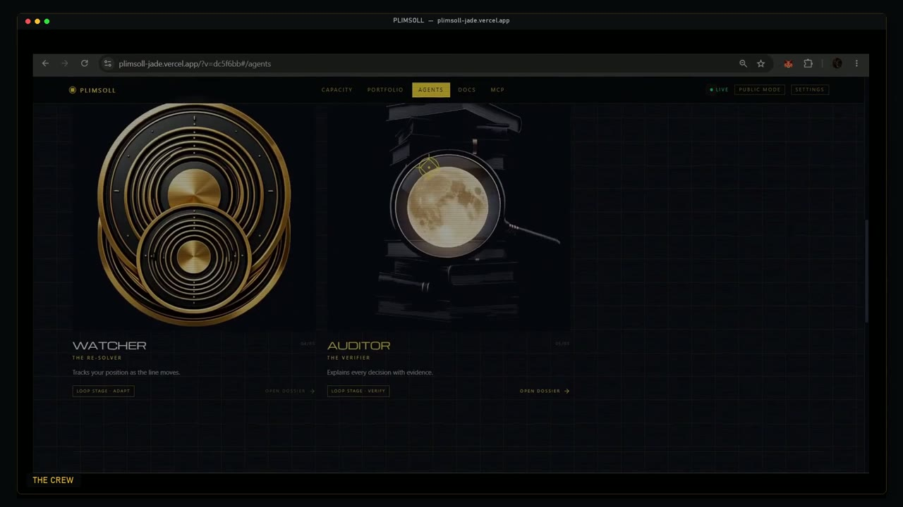
</p>

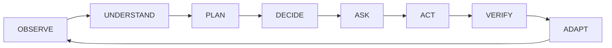

| Stage | Who | What actually happens |
|---|---|---|
| **OBSERVE** | Scout / market rail | Capture depth, 24h ticker, and `exchangeInfo`. Hash the snapshot. Refuse stale books. |
| **UNDERSTAND** | Cartographer / capacity engine | Compute cost, time, and visible-book capacities. Name the binding constraint. |
| **PLAN** | Desk core | Shape a size that still fits the line (`legalize_market`). |
| **DECIDE** | Desk core / `policy.decide` | Emit `FILL_AS_ASKED`, `SIZE_DOWN`, `TRIM_HELD`, `WAIT`, `REFUSE`, or `ASK`. |
| **ASK** | Operator | Snapshot-bound approval. Token is not a financial write. |
| **ACT** | Executor / Agent OS | `spot.newOrder` only after `CONFIRM`, writes enabled, fresh hash, live MCP bind. |
| **VERIFY** | Auditor | Parse fill, `spot.getOrder` read-back, account redact, reconcile. Partial ≠ success. |
| **ADAPT** | Watcher / `re_solve` | Re-invert held exposure on a new snapshot. Propose trim. Never silently sell. |

**Separation of concerns**

| Layer | Does | Does not |
|---|---|---|
| **Agent / host LLM** (supported Agent OS client) | Understands the ask, calls tools, explains, waits for approval | Compute capacity or invent fills |
| **PLIMSOLL intent parser** | Deterministic regex extract of symbol, `$` size, bps, horizon | Model a book or place an order |
| **Deterministic engine** | Snapshot, capacity math, legalize, decision, approval gates, reconcile | “Think” a size is safe because the prompt said so |

`run_once` is `parse_intent` → `decide`. Financial math stays in Python.

---

## Decision Model

Implemented in `backend/app/core/policy.py` and `backend/app/agent/resolve.py`.

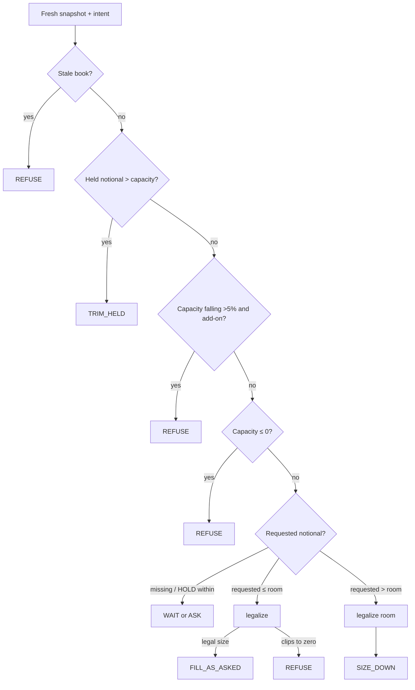

| Action | Meaning |
|---|---|
| `FILL_AS_ASKED` | Requested notional fits estimated capacity after legalize. |
| `SIZE_DOWN` | Request exceeds the line. Propose the legalized smaller size. Binding is named. |
| `TRIM_HELD` | Held mark exceeds live capacity. Propose trim. **Never a silent sell.** |
| `WAIT` | Hold / re-solve within capacity. Observe-only. |
| `REFUSE` | Stale snapshot, zero capacity, falling-capacity add-on (when that constitution flag is on), or illegal size. |
| `ASK` | Clarification needed (missing symbol or dollar size). |

`STAGE` exists as an enum value and as an operator control on the desk. The Python decision engine does not currently emit `STAGE`.

<p align="center">
  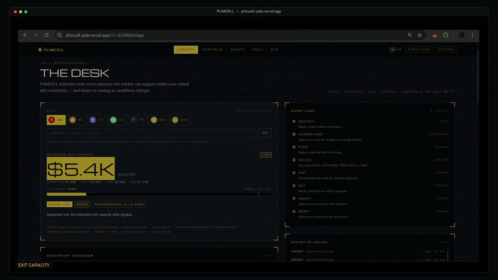
</p>

<p align="center">
  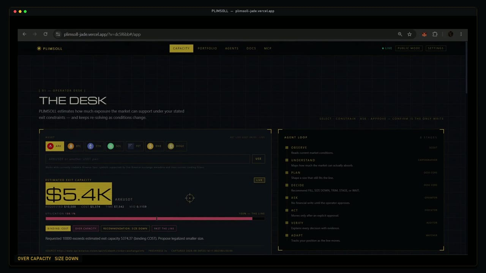
</p>

The two desk frames above are from the same live public-mode session in the film: a $1,000 ask fits; a $10,000 ask does not. Those dollar capacities are snapshot-specific. They are not a standing product metric.

---

## Built with Binance Agent OS

PLIMSOLL is built as a **Track A / Agent OS** product: public Spot market math on one side, authenticated account capabilities on official Agent OS MCP on the other.

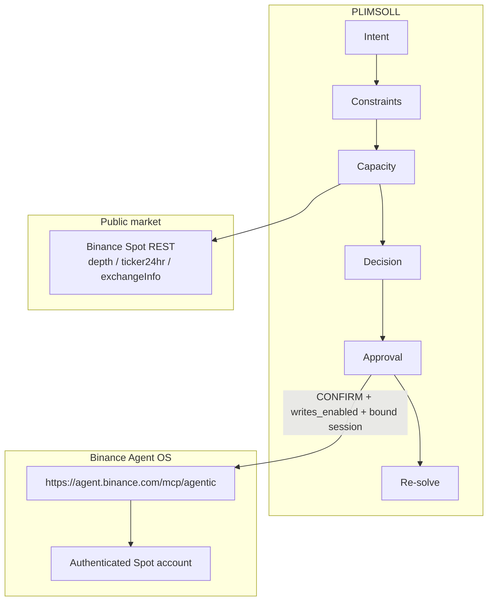

| Plane | Responsibility |
|---|---|
| **PLIMSOLL** | Intent, constraints, estimated exit capacity, decision, snapshot-bound approval, re-solving |
| **Binance Agent OS** | Authenticated account capabilities, approved execution, account / order read-back |
| **Public Spot REST** | Live book, 24h quote volume, trading filters. No secrets. |

Oregon also exposes a **PLIMSOLL MCP** at `POST /mcp`: `plimsoll.health`, `plimsoll.oauth_status`, `plimsoll.account`, `plimsoll.capacity`, `plimsoll.intent`. **There is no execute tool on that server.** Account and orders stay on official Agent OS after a supported-agent bind.

Official Agent OS OAuth (CIMD + PKCE) is implemented on the backend. Binance currently refuses this web client as an unsupported AI agent (`3346001`). The public site does not send operators down that failing authorize path. Oregon stays unbound unless a supported Agent OS client completes OAuth. Tokens never go to the browser.

A live Spot order through PLIMSOLL's execute path still requires all of:

1. `WRITES_ENABLED=true`
2. Fresh snapshot hash matching the approval
3. Unexpired approval (default TTL 30s)
4. Operator types **`CONFIRM`**
5. Runtime MCP bind of new-order **and** get-order capabilities

`POST /v1/execute` is not authorization. Kill switch `KILL_SWITCH=true` returns `HALTED`.

---

## Proof: Real Binance Agent OS Session

The demo film includes a **real** authenticated Agent OS session. It is not simulated. It is not replay fixtures.

What the recording shows:

- Official MCP endpoint `https://agent.binance.com/mcp/agentic` in a supported Agent OS client
- `spot.getAccount`: `accountType=SPOT`, `canTrade=true`, free USDT `5.01000000`
- Explicit authorization of **one** micro BUY
- Restated ticket before confirm: **ARKUSDT / BUY / MARKET / quoteOrderQty `5.00000000`**
- After: Agentic sub-account Asset Management shows **ARK `41.958`**, **USDT `0.1254`**

<p align="center">
  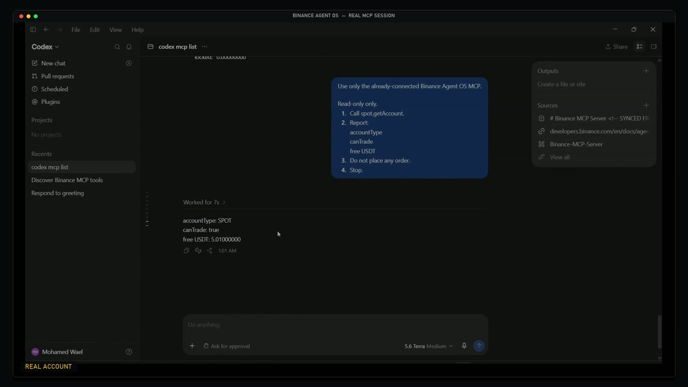
</p>

<p align="center">
  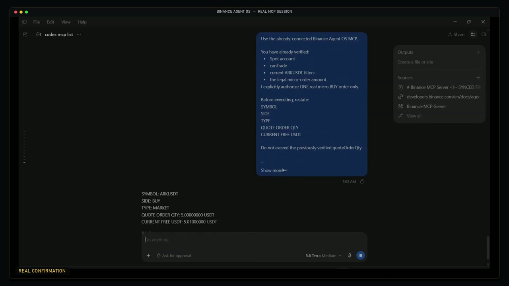
</p>

<p align="center">
  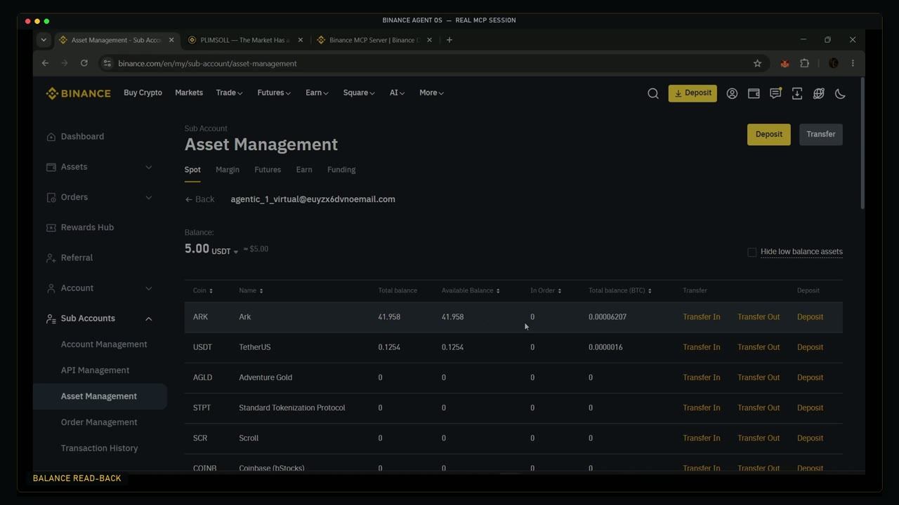
</p>

The public web app did **not** place this order. The Vercel frontend was in **PUBLIC MODE** / MCP **not bound**. The write happened in the supported Agent OS client/session. The film does not show `getOrder` or a PLIMSOLL `EXECUTED` screen for that fill — so this README does not claim those.

> Real execution evidence is shown in the attached demo video. The public PLIMSOLL website remains honest about its account connection state.

---

## Demo Walkthrough

What the 2:54 film actually shows:

1. **Landing** — load-line product, `LIVE` + `PUBLIC MODE`, invert → legalize → approval → act → verify → re-invert.
2. **Problem / current solve** — mark-style ask versus live estimated exit capacity; the line moves.
3. **Desk** — eight-stage loop; `$1,000` ARKUSDT **FILL AS ASKED** / **WITHIN**.
4. **Constitution** — writes off, confirmation required, MCP not bound on the public site.
5. **Over capacity** — `$10,000` ask, **SIZE DOWN**, binding **COST**.
6. **Capacity over time** — live series, **WRITES OFF — APPROVAL IS NOT AN ORDER**.
7. **Crew** — Watcher (ADAPT) and Auditor (VERIFY).
8. **Agent OS title** — cut to a real MCP session, not the Vercel execute button.
9. **Real transaction** — account read, explicit one-order authorize, `5` USDT ARKUSDT MARKET BUY, balance read-back.
10. **Return to the desk** — public PLIMSOLL still solving; still not pretending the website sent the order.

<p align="center">
  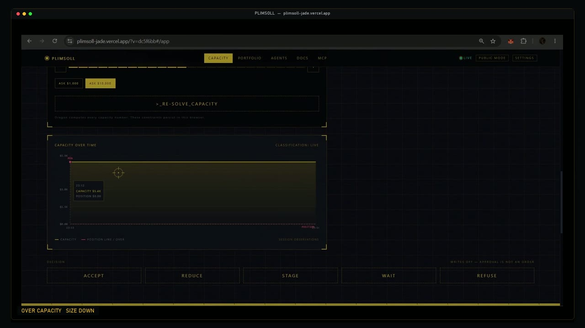
</p>

<p align="center">
  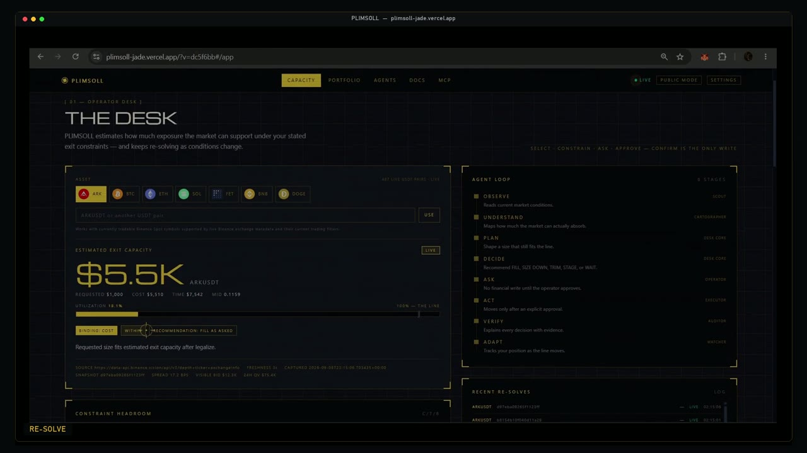
</p>

---

## Safety by Design

PLIMSOLL does not silently execute a financial action because an agent “thinks” it is appropriate. Where implemented:

| Control | Behavior |
|---|---|
| Writes off by default | `WRITES_ENABLED=false` |
| Kill switch | `KILL_SWITCH=true` → execute `HALTED` |
| Typed confirmation | Body or `X-PLIMSOLL-CONFIRM` must be exactly `CONFIRM` |
| Snapshot-bound approval | Token encodes decision + snapshot hash; mismatch → `SNAPSHOT_MISMATCH` |
| Approval TTL | Default 30 seconds; expired → `APPROVAL_EXPIRED` |
| Stale snapshots | Age `> stale_timeout_ms` → `REFUSE` |
| Idempotency | `newClientOrderId = plim_{sha256(intent_id:slice)[:16]}`; get-order before new-order suppresses duplicates |
| Partial fills | Not success. Remaining size needs a **new** approval |
| Read-back | `spot.getOrder` + redacted `spot.getAccount` after a write |
| No silent sells | Over-capacity proposes `TRIM_HELD` |
| No execute on PLIMSOLL MCP | Oregon `POST /mcp` cannot place orders |
| No secrets in the browser | Frontend talks only to the PLIMSOLL API |
| Fail-closed MCP | Timeout, missing tool, and HTTP errors become typed error classes — not retries that invent a fill |

This is workflow safety, not a guarantee that a live market order will fill as estimated.

---

## What Is Live vs What Is Test

| Component | Status | Source |
|---|---|---|
| Public market snapshots | **LIVE** when the backend classifies them so | Official Spot REST (`/depth`, `/ticker/24hr`, `/exchangeInfo`); Oregon falls back to `data-api.binance.vision` |
| Exchange filters | **LIVE** at snapshot time | `exchangeInfo` for that symbol |
| Symbol universe | **LIVE** TRADING USDT Spot pairs | `GET /v1/symbols` from current `exchangeInfo` |
| Public website | **LIVE** UI against Oregon | https://plimsoll-jade.vercel.app/ — **PUBLIC MODE**, MCP unbound |
| Agent OS session in the film | **LIVE** authenticated | Official MCP + supported client; real 5 USDT ARKUSDT MARKET BUY |
| Capacity / policy / legalize tests | **REPLAY** | Fixture books in `backend/tests` |
| Property tests | **REPLAY** | Hypothesis over synthetic books and steps |
| Execute / MCP tests | **TEST** | Confirm required, writes disabled, duplicate suppression — no live order |
| Frontend tests | **TEST** | Vitest mapping of Oregon payloads |
| Replay request field | **REPLAY** | `POST /v1/capacity` and `/v1/intent` accept an explicit replay snapshot |

Every payload is labelled `LIVE`, `REPLAY`, `PAPER`, `TESTNET`, `SIMULATED`, or `UNKNOWN`. Replay is tests, not the product feed.

---

## Validation

Verified against this repository:

| Suite | Count | Command |
|---|---|---|
| Backend | **98** pytest cases | `cd backend && python -m pytest -q` |
| Frontend | **5** Vitest cases | `cd frontend && npm test` |
| CI | GitHub Actions on `main` | pytest + `npm test` + `npm run build` |

Backend coverage by area (test modules, not coverage %):

- Capacity engine, cost/time monotonicity, stale/crossed/empty books
- Filters and `legalize_market` (including symbol-agnostic step fixtures)
- Agent / policy / re-solve
- API, OAuth start/callback deny, PLIMSOLL MCP (no execute)
- MCP bind, timeout / missing-tool fail-closed
- Execute gates (CONFIRM, writes off, kill switch, partial parse, duplicate `clientOrderId`)
- DB / Alembic isolated schema
- One **LIVE** public REST snapshot test for `ARKUSDT` (no hardcoded prices)

Release-lock checks recorded for this project (not re-claimed as live dashboards): production Oregon health with writes off / MCP unbound; live intent on ARK `$1,000` → `FILL_AS_ASKED` and `$10,000` → `SIZE_DOWN`; live snapshots across multiple USDT pairs including BTC, ETH, and ARK; Chrome desktop and 390×844 mobile QA of public mode; public HTML checked so it does not embed API keys, GitHub tokens, or database URLs.

No coverage percentage is claimed.

---

## Architecture

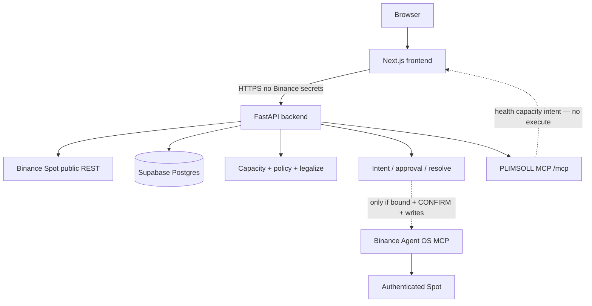

| Piece | What it is |
|---|---|
| Frontend | Next.js App Router, hash routes (`/`, `#/app`, `#/portfolio`, `#/agents`, `#/docs`, `#/docs/mcp`, `#/settings`) |
| Backend | Python 3.12 FastAPI (`backend/app`) |
| Database | Supabase PostgreSQL — Alembic on `DIRECT_URL`; pooler `DATABASE_URL` at runtime |
| Market data | Official public Spot REST; fallback `https://data-api.binance.vision` |
| Account / orders | Official Agent OS MCP after runtime tool discovery |
| Production API | Render free instance, **Oregon** (`https://plimsoll-oregon.onrender.com`) |
| Production UI | Vercel — https://plimsoll-jade.vercel.app/ |

Frankfurt Render egress received HTTP 418 from Binance public REST. Oregon uses the official market-data host. Free Render services sleep after idle; the first request can take about a minute.

The frontend default `NEXT_PUBLIC_API_BASE` is the Oregon origin. Prisma/SQLite exists in the frontend template and is not on the live capacity path.

---

## Symbol-Agnostic by Design

PLIMSOLL is not an ARK-only application.

`GET /v1/symbols` returns currently **TRADING** Binance Spot **USDT** pairs from live `exchangeInfo` (status TRADING, spot allowed). Lot size, step, min notional, and tradability are read per snapshot.

ARKUSDT is the validation pair and the demonstrated micro-transaction. Shortcuts on the desk (ARK, BTC, ETH, …) are not the tradable universe. This README does not freeze a symbol count — that number changes with the exchange.

---

## Repository Structure

```text
backend/
  app/
    api/          HTTP routes + PLIMSOLL MCP (no execute)
    agent/        intent, loop, approval, execute, reconcile, resolve
    core/         capacity, cost, book, filters, sizing, policy
    rails/        Spot REST, Agent OS MCP client, OAuth
    state/        Postgres snapshots and fills
  tests/          pytest (replay + one live REST snapshot)
  alembic/        schema migrations
frontend/         Next.js UI — consumes Oregon, does not compute capacity
.github/workflows/ci.yml
render.yaml       Oregon free web service
.env.example      Variable names only
docs/demo/        Judge film
docs/images/      Frames from that film
```

---

## Run Locally

Python **3.12** (`.python-version` is `3.12.8`; CI uses 3.12). Node **22** in CI.

```powershell
cd backend
python -m pip install -r requirements.txt
copy ..\.env.example ..\.env
# fill secrets locally; do not commit .env
python -m pytest -q
python -m uvicorn app.main:app --host 0.0.0.0 --port 10000
```

```powershell
cd frontend
npm install
npm test
npm run dev
```

`NEXT_PUBLIC_API_BASE` defaults to the Oregon Render URL. For a local API:

```powershell
$env:NEXT_PUBLIC_API_BASE="http://127.0.0.1:10000"
npm run dev
```

Health: `GET /health` · Ready: `GET /ready`

### Environment variable names

From `.env.example` and `backend/app/config.py`. Do not put values in git.

| Name | Purpose |
|---|---|
| `APP_NAME` | Process name |
| `NODE_ENV` | `development` / `production` |
| `PORT` | Bind port (Render default `10000`) |
| `CORS_ORIGIN` | Allowed origins |
| `DATABASE_URL` | Postgres pooler (runtime) |
| `DIRECT_URL` | Postgres direct (migrations) |
| `BINANCE_REST_BASE` | Public REST origin |
| `BINANCE_REST_FALLBACK` | Official market-data-only origin |
| `BINANCE_MCP_URL` | Official Agent OS MCP |
| `BINANCE_WS_BASE` | Public stream origin (reserved) |
| `WRITES_ENABLED` | Must stay `false` until you choose otherwise |
| `KILL_SWITCH` | Halt writes |
| `BINANCE_MCP_ACCESS_TOKEN` | Optional server-side MCP bearer (never commit) |
| `OAUTH_PUBLIC_BASE` | Public API origin for CIMD client id |
| `OAUTH_FRONTEND_ORIGIN` | Allowed frontend origin after OAuth |

`PYTHON_VERSION=3.12.8` is set on Render. `NEXT_PUBLIC_API_BASE` is frontend-only.

---

## Reproducing the Agent OS Workflow

Use the **official** endpoint and a **supported** Agent OS client. Do not copy tokens. Do not spoof API keys. Do not bypass Binance’s client allowlist.

1. Add MCP URL `https://agent.binance.com/mcp/agentic` in a currently supported Agent OS client.
2. Complete Binance OAuth in that client. Trade on the **Agentic virtual sub-account** created at OAuth — not a Normal Sub.
3. Start **read-only**: `spot.getAccount` (and market tools as needed). Confirm `canTrade` and balances yourself.
4. Keep PLIMSOLL `WRITES_ENABLED=false` until you intend a real order.
5. If you choose to use real funds, use the **smallest practical** legal size from **live** filters (`minNotional`), restate symbol / side / type / quote qty, and type **CONFIRM** only for that one ticket.
6. Read back account / balances. Partial fills are not success.
7. Never put credentials in source, `.env` commits, or the frontend.

The public website remaining in PUBLIC MODE is expected until Binance allowlists a web CIMD client. That is not a license to impersonate another agent.

---

## Limitations

- Exit capacity is an **estimate** on visible bids + 24h volume + stated constraints.
- The book can change between snapshot, approval, and fill.
- Real execution follows live market conditions, not the estimate.
- The public Vercel app does not currently hold an authenticated Agent OS bind (`3346001` for this CIMD web client).
- Agent OS writes require a supported client, trading permission, and explicit confirmation.
- `getAccount` does not label Agentic vs master — use the Agentic virtual sub.
- `STAGE` is a desk control / enum; the engine does not emit it today.
- `Binding.FILTER` exists on the schema; estimated capacity is `min(cost, time, book fraction)` then legalize.
- Free Render sleep; some cloud IPs are HTTP 418 against Binance REST.
- This is not financial advice.

---

## Why PLIMSOLL?

| Traditional | PLIMSOLL |
|---|---|
| "What is my position worth?" | "How much exposure can the market support under my exit constraints, and does my position still fit?" |
| Size from mark × qty | Size from the **binding** of cost, time, and visible book, then exchange filters |
| Agent “decides” a trade | Agent proposes; deterministic math bounds; operator confirms |
| One shot | Re-solve. The line moves when the market moves. |

---

# Try PLIMSOLL

🌐 Live: https://plimsoll-jade.vercel.app/

💻 Source: https://github.com/mohamedwael201193/PLIMSOLL

🎥 Demo: https://x.com/Mowael777/status/2097473610445209852

Official Binance Agent OS: https://agent.binance.com/mcp/agentic

> The line moves when the market moves.
